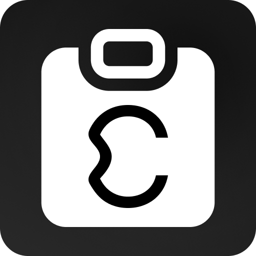

<p align="center">
  
</p>

<h1 align="center">Clipcywin</h1>

<p align="center">
  A featherweight clipboard-history bar and dynamic island for Windows 11.<br>
  Native Rust + Win32 + Direct2D. No Electron, no background browser, no telemetry.
</p>

<p align="center">
  <a href="https://buymeacoffee.com/cywinskiweb"></a>
  
  
  
</p>

---

Clipcywin keeps your recent copies one keystroke away. It lives as a slim bar above the taskbar or as a floating "dynamic island" and pastes any item with **Win + Ctrl + number**.

**Why another clipboard manager?** Because the existing ones are either heavy web wrappers or feel bolted on. Clipcywin starts in ~50 ms, idles at ~10 MB of RAM with 0 % CPU, and is drawn with the same GPU pipeline Windows uses for its own flyouts.

## Features

### Display
- **Bar mode** with three placements: *docked* (reserves screen space like a second taskbar), *overlay* (floats above windows) and *on demand* (appears on a shortcut, at the screen edge or after a copy, then hides).
- **Island mode**: an animated pill anchored to the top, bottom, left or right of any monitor that expands on hover, on a new copy or while the modifier chord is held.
- Pill or card item styles, size presets, alignment for both the bar and its content, margins, opacity, custom colors, acrylic blur with rounded corners, Mica, dark/light/system theme, Windows or custom accent.
- Image thumbnails with dimensions, file lists, code detection with a monospace font, active-item highlight, hover previews that show the **full** content.

### Speed
- **Win + Ctrl + 1…9, 0** pastes the n-th item straight into the active window (modifiers configurable; the badges light up while the chord is held).
- Click to copy, middle-click to delete, wheel to scroll, an overflow list for everything that does not fit.
- History persists in SQLite; images are stored as PNG on disk and only thumbnails stay in memory.

### Shelves
- Drop files, text or images from any app onto the shelf button (or the open panel).
- Drag the shelf back out into Explorer, an e-mail or a chat to drop everything at once; text entries are joined into one paste.
- Multiple named, colored shelves; the panel is a free window you can leave anywhere.

### Privacy
- Password managers' "do not record" clipboard flags are honored; known password-manager processes are masked; a text heuristic catches password-like strings from anywhere else.
- Masked items expire automatically, can be revealed for a few seconds, and are never previewed.
- The bar is **excluded from screenshots and recordings** (`WDA_EXCLUDEFROMCAPTURE`) and additionally hides when a capture tool comes to the foreground or a screenshot key is pressed.

### Polish and English UI. Everything is configurable from a settings window that applies changes live.

## Performance

| | first frame | private memory (idle) | threads |
|---|---|---|---|
| Clipcywin (default WARP renderer) | ~50 ms | ~10 MB | 16 |
| same, hardware D3D11 on an NVIDIA GPU | ~460 ms | ~57 MB | 41 |

The software rasterizer wins for a bar that draws a few small frames a minute, so it is the default. Switch to `hardware` in `settings.json` if you prefer.

## Install

1. Download `clipcywin.exe` and `WebView2Loader.dll` from the [Releases](https://github.com/Cywinskiweb/clipcywin/releases) page and put them in one folder.
2. Run `clipcywin.exe`. A tray icon appears; the bar shows up above the taskbar.
3. Optional: enable **Start with Windows** in Settings › General.

The settings window needs the WebView2 runtime, which every Windows 11 installation already has. The bar itself has no dependencies.

### Build from source

```bash
cargo build --release
```

Requires the Rust MSVC toolchain and the Windows 10 SDK (for `rc.exe`). Output lands in `target/release/`.

## Usage

| Action | How |
|---|---|
| Paste item *n* into the active app | `Win + Ctrl + n` |
| Show/hide the bar (expand the island) | `Win + Ctrl + \`` |
| Copy an item to the clipboard | click |
| Delete an item | middle-click or the × on hover |
| Item menu (pin, mark sensitive, add to shelf, open…) | right-click |
| Open the full list | the `…` / `+N` button |
| Open a shelf | click the shelf button at the right end |
| Drag everything out of a shelf | drag the ⠿ grip in the panel header |
| Open settings | tray icon › Settings, or `clipcywin.exe --settings` |

Command-line flags: `--settings`, `--toggle`, `--reload` (re-read `settings.json`) and `--autostart`.

## Configuration

Everything lives in `%LOCALAPPDATA%\Clipcywin\settings.json` and is editable from the settings window. Notable sections: `mode`, `bar`, `island`, `layout`, `appearance`, `preview`, `hotkeys`, `capture`, `privacy`, `hide`, `shelves`, `general`.

## Known limitations

- Explorer's own `Win + Ctrl + <n>` (switch to the pinned app) is suppressed while Clipcywin runs with the default chord. Change the modifiers if you rely on it.
- Windows does not deliver keyboard hooks while an elevated window is in the foreground; pasting there falls back to "copied, press Ctrl+V".
- Passwords typed into browser password fields carry no privacy flags, so only the heuristic can catch them.
- Some legacy GDI screenshot tools show a black rectangle where the bar is instead of omitting it.

## Support

Clipcywin is free and open source. If it saves you time, you can [buy me a coffee](https://buymeacoffee.com/cywinskiweb). There is also a button for it in Settings › About.

## License

MIT. See [LICENSE](LICENSE).
